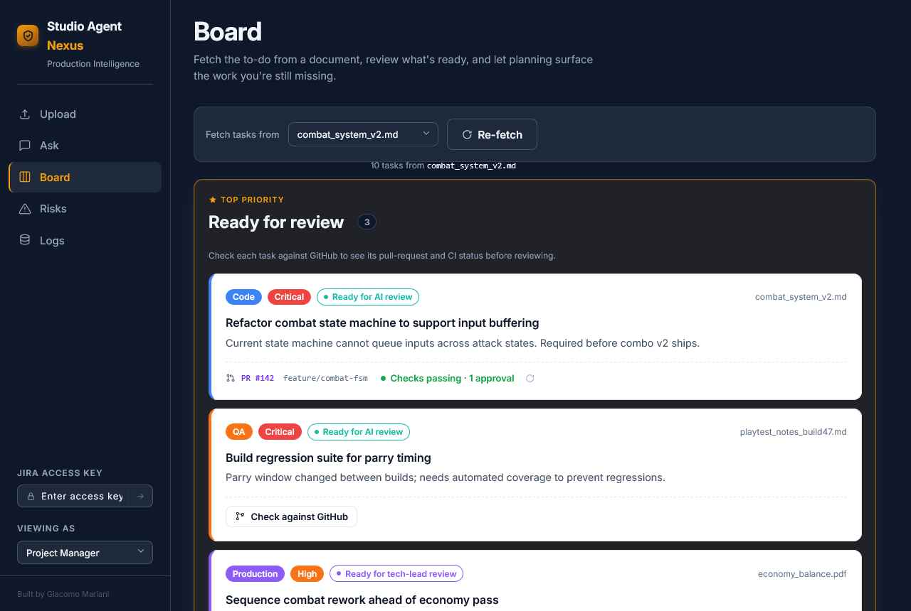

# Studio Agent Nexus


**An agentic AI workflow for game production: grounded answers, prioritised tasks,
and risk detection from the documents teams already write. Cited, costed, and observable.**



---

Studio Agent Nexus brings AI to production management. It ingests design documents,
bug reports, and technical specs, then uses retrieval-augmented generation and 
agentic reasoning to:

- Answer questions with **grounded citations** from the uploaded documents
- Extract **prioritised, department-tagged tasks**
- Detect **risks and contradictions** across documents
- Propose the **work a plan is still missing**
- Keep every interaction **logged, costed, and auditable**

Built on 15+ years of tech-lead experience (systems thinking, feedback loops,
real-world constraints, tooling, iteration) applied to modern agentic AI engineering.

> An example in action: [Link]

**[Get it running in 5 minutes](docs/quickstart.md)**

---

## The product

A Streamlit UI over a FastAPI backend, organised as five surfaces:

- **Upload**: manage the knowledge base, ingest Markdown/PDF with chunk + status feedback.
- **Ask**: grounded Q&A with citation cards and an explicit fallback state.
- **Board**: review a source document's tasks — what's ready, a planning pass that
  surfaces missing work, and tracking by state (backlog / to-do / doing / done).
- **Risks**: surface risks and cross-document contradictions, side by side with sources.
- **Logs**: a durable audit log of every question, answer, model, and token cost.

Each page carries a "How it works" footer mapping the UI to the
engineering behind it.

---

## How it works

| Capability | What it proves | Where |
|---|---|---|
| **RAG pipeline** | Ingest → chunk → embed → hybrid retrieve → ground | `services/retrieval_service.py`, `services/chunking.py`, `services/document_ingestion_service.py` |
| **Citation grounding** | Every factual claim traced to a source doc + snippet + score | `services/document_answering_service.py` |
| **Fallback logic** | The agent declines when evidence is weak instead of inventing answers | `services/llm_document_answerer.py` |
| **Agentic reasoning** | Multi-step orchestration, not a single prompt | `services/document_answerer_factory.py`, board planning (in progress) |
| **Structured output** | Schema-validated results safe to pipe into real tools | `models/`, Pydantic throughout |
| **Provider-agnostic LLM** | Swap Gemini ↔ Groq ↔ OpenAI ↔ deterministic stub via env var; rule-based safety net | `providers/`, `services/document_answerer_factory.py` |
| **Human-in-the-loop tool use** | Every side-effecting action is held pending until a human confirms it | `services/tool_assistant_service.py`, `tools/production_tools.py` |
| **Evaluation harness** | Citation rate, fallback rate, latency tracked across runs | `services/document_qa_evaluation_service.py`, `scripts/run_document_qa_eval.py` |
| **Observability & cost** | Every query logged with tokens, estimated cost, latency, sources | `services/usage_tracking_service.py`, `services/document_query_log_store.py` |
| **Production hygiene** | Typed services, API-key auth, Docker, test suite, linting | `auth.py`, `Dockerfile`, `entrypoint.sh`, `tests/` |

---

## Architecture

```text
        Streamlit UI  (frontend/)
              │  HTTP only (X-API-Key)
              ▼
        FastAPI API   (main.py, auth.py)
              │
   ┌──────────┼───────────────────────────────┐
   ▼          ▼                                 ▼
 Ingestion  Retrieval + Answering          Observability
 (chunk,    (hybrid vector + keyword,      (query logs,
  embed,     citations, fallback,           usage + cost,
  PDF parse) rule / LLM answerer)           evaluation)
   └──────────┴───────────────┬─────────────────┘
                              ▼
                      SQLite  (documents, chunks, jobs,
                               logs, usage, eval results)
```

Local embeddings use `sentence-transformers/all-MiniLM-L6-v2`. Retrieval combines vector
similarity with keyword overlap. The answerer is pluggable: Google Gemini (the default), Groq, OpenAI,
or a deterministic rule-based path for safe local/demo use,
with automatic fallback to the rule path on failure or low confidence.

---

## Tech stack

Python 3.12 · FastAPI · Streamlit · SQLite (SQLAlchemy + Alembic) ·
sentence-transformers · google-genai · groq · OpenAI SDK · pypdf · pytest · Ruff · Docker

---

## Roadmap

**Shipped recently:** risk and contradiction detection as a first-class agentic service;
a presentation pass on grounded answers and citation snippets; structure-aware chunking
with a retrieval relevance floor.

**Now:** LLM-backed task extraction and planning gap-detection to complete the
document → plan pipeline.

**Later:** export to external trackers (Jira / Trello / Slack) with role-based actions,
and a per-request live-AI mode toggle for cost-controlled demos.

The bar throughout: every new capability ships grounded, evaluated, and observable.
No feature lands without citations, eval coverage, and cost tracking.

---

## Documentation

- [Quick start](docs/quickstart.md): install, configure, and run locally or in Docker.

---

Built by Jack Mariani. [LinkedIn](https://www.linkedin.com/) · [Email](mailto:giacomo.p.mariani@gmail.com)